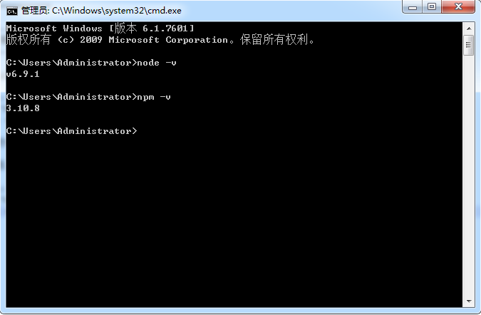

===================================
1.环境及工具配置
===================================

--------------------------------------
一，node下载安装(已安装可忽略)
--------------------------------------

1,登录nodejs官网：https://nodejs.org/en/，如下图所示

 
根据自己的电脑系统下载到对应的版本，下载到本地后安装一路”next”吧

2,安装完成后，打开电脑的全局命令行检查是否安装好，执行如下命令查看::

	node -v
	
	npm -v
	

 

3,本人安装的node版本为支持windows64位下的V6.9.1LTS，由于NodeJS已经集成了npm，所以安装完node，npm也就一并安装好了，执行如下命令即可查看npm版本::

  npm -v
  
------------------------
二，npm
------------------------

npm（node package manager）是nodejs的包管理器，用于node插件管理（包括安装、卸载、管理依赖等）

1,使用npm安装插件：命令提示符执行::

	npm install <name> [-g] [--save-dev]   //eg: npm install gulp-less --save-dev

参数说明:

<name> : node插件名称；
	
-g ：全局安装，将会安装在C:\Users\Administrator\AppData\Roaming\npm，并且写入系统环境变量；非全局安装,将会安装在当前定位目录； 全局安装可以通过命令行在任何地方调用它，本地安装将安装在定位目录的node_modules文件夹下，通过require()调用；
	
--save ：将保存配置信息至package.json（package.json是nodejs项目配置文件）;
	
-dev ：保存至package.json的devDependencies（开发模式）节点，不指定-dev将保存至dependencies（生产模式）节点；
	
	

2,使用npm卸载插件::

	npm uninstall <name> [-g] [--save-dev] 
	
说明：不要直接删除本地插件包 

3,使用npm更新插件::

	npm update <name> [-g] [--save-dev] 
	

4,更新全部插件::

	npm update [--save-dev] 
	

5,查看npm帮助::

	npm help 
	

6,查看当前目录已安装插件::

	npm list

-------------------
三，cnpm替换npm
-------------------

因为npm安装插件是从国外服务器下载，受网络影响大，可能出现异常，如果npm的服务器在中国就好了，而乐于分享的淘宝团队干了这事。

来自官网：“这是一个完整 npmjs.org 镜像，你可以用此代替官方版本(只读)，同步频率目前为 10分钟 一次以保证尽量与官方服务同步。”

1,官方网址：http://npm.taobao.org

2,安装淘宝镜像执行如下命令::

	npm install -g cnpm --registry=https://registry.npm.taobao.org
	

3,安装完后最好查看其版本号cnpm -v或关闭命令提示符重新打开，安装完直接使用有可能会出现错误 

注意：cnpm跟npm用法完全一致，只是在执行命令时将npm改为cnpm即可。

---------------------------
四，webstorm最新版安装
---------------------------

1,登录webstorm官网：http://www.jetbrains.com/webstorm/，下载最新版本WebStorm 2017.1。

2,下载安装webstorm最新版本后，自行在网上搜索破解方法（中文包可以下载配置，个人建议还是使用原英文版）。

3,开发vuejs使用最新webstorm版本是为了更好的支持vuejs开发，新版webstorm增加了新的功能介绍如下::

	与Jest集成：从IDE运行Jest测试，并在编辑器中立即看到测试状态，或者在一个方便的树状视图中，您可以从中快速跳转到测试。
		
	支持Vue.js：Vue.js支持来到WebStorm：Vue模板中的编码帮助，Vue组件的完成，导航和自动导入等等。

	支持标准样式：WebStorm现在可以根据标准样式格式化JavaScript代码。新添加的代码样式选项给您更多的灵活性。
	

具体可参看webstorm官网介绍
	
	

	

