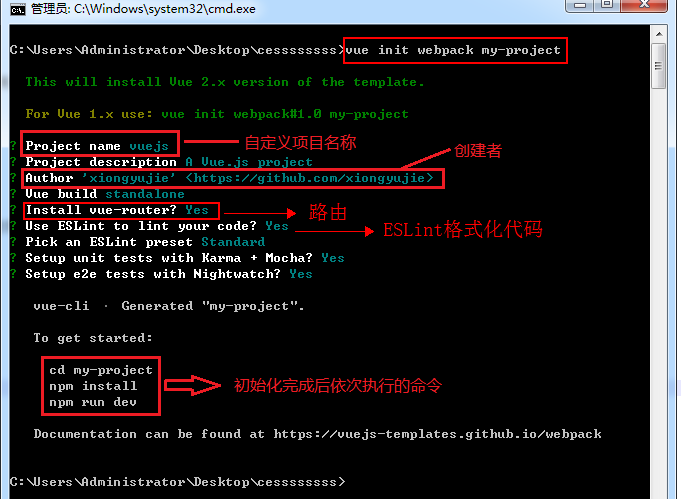
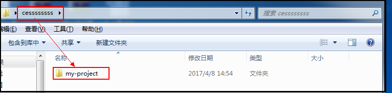
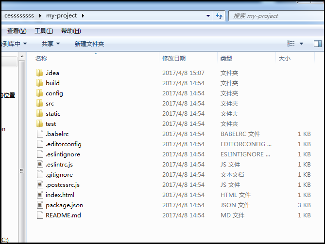
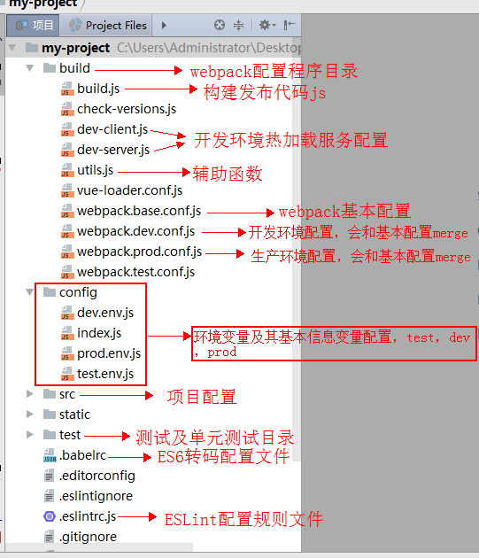
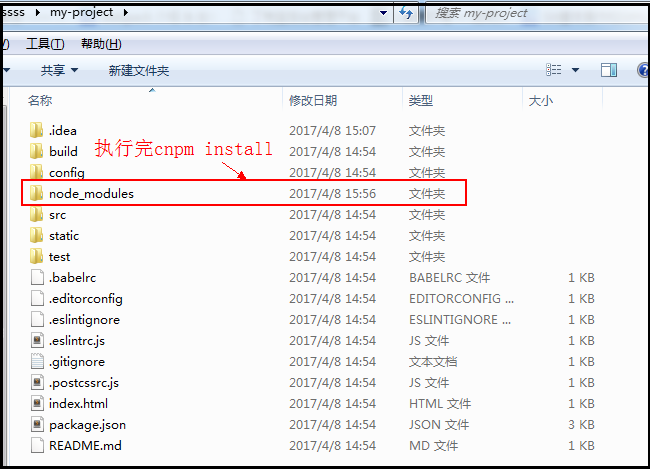
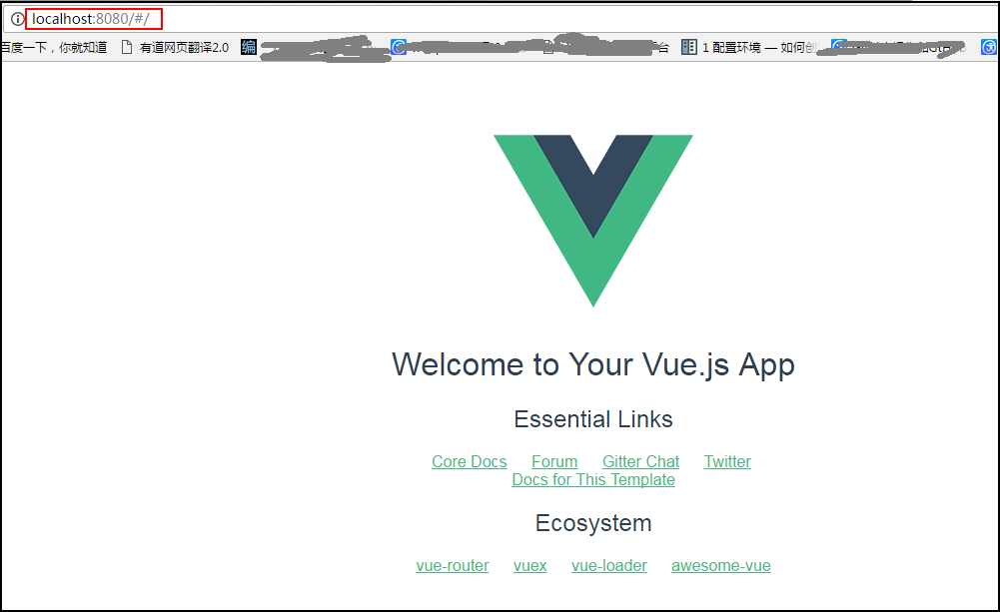
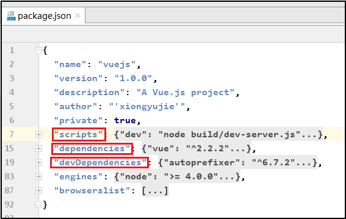
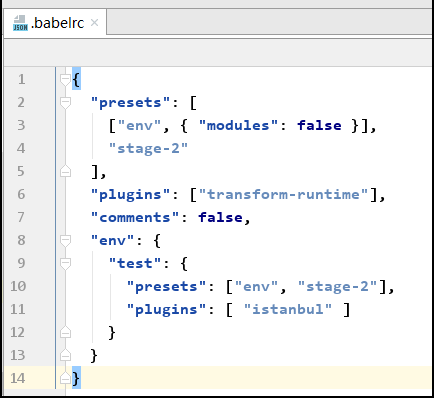
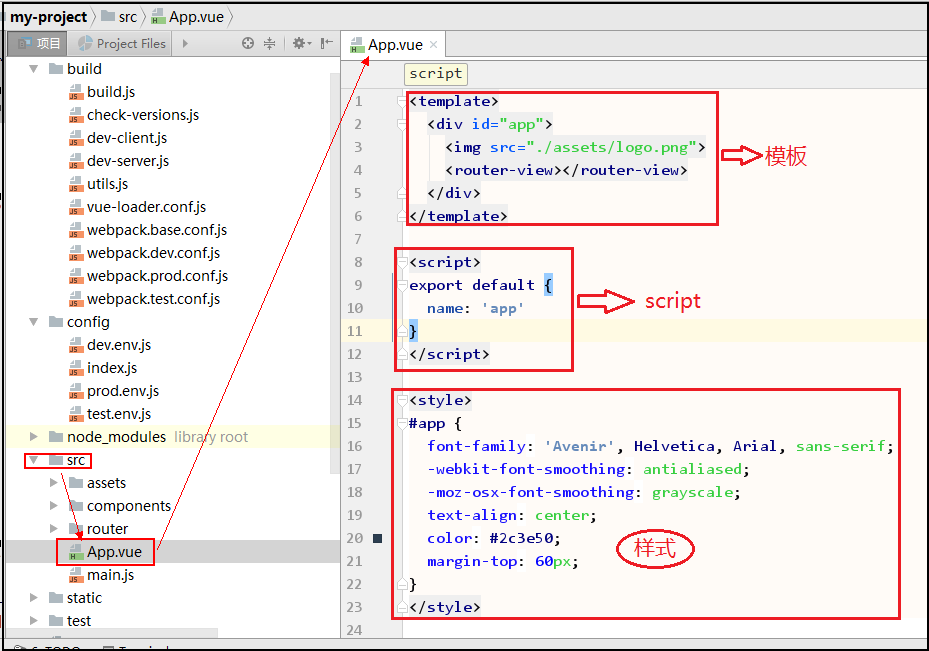

====================
2.Vue脚手架安装
====================

在安装了node环境下操作如下步骤

---------------------------
一，安装vue-cli（脚手架）
---------------------------

1,Vue-cli是用node编写的命令行工具，我们需要进行全局安装::

	npm  install –g  vue-cli
	
	
2,定位到创建项目的目录下，执行如下命令::

	vue  init(建议用vue init webpack my-project)
	
建议使用vue-cli来快速生成一个基于webpack构建的项目，定位到创建项目的目录下，输入如下命令::

	vue  init  webpack my-project
	
如下图所示：

执行完后会得到如下所示文件夹：

 

	
3,安装完命令行给出的提示，进入my-project文件其结构目录如下图：

4,目录结构说明如下：

5,下载依赖包模块执行如下命令::

  npm  install  //建议还是使用cnpm install下载快点
  
执行完命令后文件中会生成node-modules文件

6,开发模式执行::

	npm  run  dev
	
执行完后会弹出页面如下所示：

 

7,打包生产执行::

	npm  run  build

------------------------
二，部分文件说明
------------------------

1,package.json如下图所示：

 
说明：package.json文件是项目配置文件，三个重要项如下::

	dependencies：项目发布时的依赖
	
	devDependencies：项目开发时的依赖
	
	scripts：编译项目的一些命令
 
 
2,.babelrc文件 

.babelrc文件定义了ES6的转码规则，基于ES6编写的js代码在编译时都会被babel转码器转换为ES5代码。

 
 
3,main.js

这里是入口文件，可以引入一些插件或者静态资源，当然引入之前要先安装了该插件，在pack.json文件中有记录；main.js部分内容说明如下::

	/*引入Vue框架*/
	
	import Vue from 'vue'
	
	/*引入资源请求插件*/
	
	import VueResource from 'vue-resource'
	
	/*重置样式*/
	
	import "assets/css/base.css"
	
	/*基本JS*/
	
	import "assets/js/common.js"
	
	/*引入路由设置*/
	
	import "./routers.js"
	
	/*使用VueResource插件*/
	
	Vue.use(VueResource)
	
	
4,App.vue

一个标准的vue组件，包含三个部分，一个是模板，一个是script，一个是样式，这里需要了解vue的基础。

5,index.html 

主页我们可以像平时普通的html文件一样引入文件和书写基本信息，添加meta标签等，具体不在说明。

