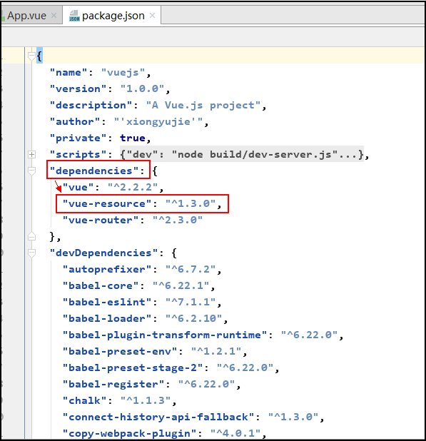

====================================
4.Ajax之vue-resource
====================================

vue-resource是用来和后端交换数据的，就像jQuery中的$.ajax。可以放在created或者ready里面运行来获取或者更新数据。
 
vue-resource文档地址：

	https://github.com/pagekit/vue-resource
 
-----------------
一，使用安装
-----------------

1,在项目文件下通过执行如下命令来下载安装vue-resource::

	npm install vue-resource --save
	

执行完成后package.json文件中显示如下：

 
 
2,HTTP用法

http服务可以在全局Vue.http或Vue实例中使用this.$http,具体可以参看文档：

	https://github.com/pagekit/vue-resource/blob/develop/docs/http.md

Vue实例提供this.$http可以发送HTTP请求的服务。一个请求方法调用返回一个解决响应的Promise。此外，Vue实例也将自动绑定到this所有函数回调::

	{
	 // GET /someUrl
	 this.$http.get('/someUrl').then(response => {
		// success callback
	 }, response => {
		// error callback
	 });
	}

3,http拦截器Interceptors

请求处理::

	Vue.http.interceptors.push(function(request, next) {

	  // modify method
	  request.method = 'POST';

	  // modify headers
	  request.headers.set('X-CSRF-TOKEN', 'TOKEN');
	  request.headers.set('Authorization', 'Bearer TOKEN');

	  // continue to next interceptor
	  next();
	});

请求和响应处理::

	Vue.http.interceptors.push(function(request, next) {

	  // modify request
	  request.method = 'POST';

	  // continue to next interceptor
	  next(function(response) {

		// modify response
		response.body = '...';

	  });
	});

返回响应和停止处理::

	Vue.http.interceptors.push(function(request, next) {

	  // modify request ...

	  // stop and return response
	  next(request.respondWith(body, {
		status: 404,
		statusText: 'Not found'
	  }));
	});

	

 